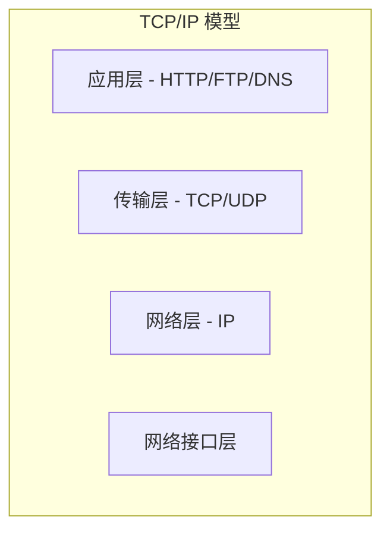

# 计算机网络

> 理解计算机网络是后端开发的必备知识。

## TCP/IP 四层模型



## TCP vs UDP

| 特性 | TCP | UDP |
|------|:---:|:---:|
| 连接 | 面向连接 | 无连接 |
| 可靠 | 可靠 | 不可靠 |
| 速度 | 慢 | 快 |
| 应用 | HTTP、HTTPS | DNS、视频直播 |

## TCP 三次握手

```
1. Client → Server: SYN (Seq=x)
2. Server → Client: SYN+ACK (Seq=y, Ack=x+1)
3. Client → Server: ACK (Seq=x+1, Ack=y+1)
```

## HTTP

- **HTTP/1.1**: 持久连接、管线化
- **HTTP/2**: 多路复用、头部压缩、服务端推送
- **HTTP/3**: 基于 QUIC（UDP）

### 状态码

| 状态码 | 含义 |
|:------:|------|
| 2xx | 成功 |
| 3xx | 重定向 |
| 4xx | 客户端错误 |
| 5xx | 服务端错误 |
