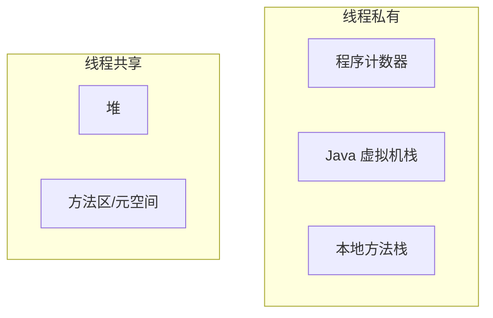

# JVM 虚拟机

> 理解 JVM 是进阶 Java 高手的必经之路。

## 内存结构

### 各区域作用

| 区域 | 作用 | 异常 |
|------|------|------|
| 程序计数器 | 当前线程执行的字节码行号 | 无 |
| 虚拟机栈 | 存储局部变量表、操作数栈 | StackOverflowError |
| 堆 | 存储对象实例 | OutOfMemoryError |
| 方法区 | 存储类信息、常量、静态变量 | OutOfMemoryError |

## 垃圾回收

### 判断对象存活

- **引用计数法**（主流 JVM 未使用）
- **可达性分析算法**（GC Roots 搜索）

### 常用 GC 算法

| 算法 | 方式 | 特点 |
|------|------|------|
| 标记-清除 | 标记后直接清除 | 有内存碎片 |
| 标记-复制 | 复制到另一半 | 无碎片，空间减半 |
| 标记-整理 | 标记后整理 | 无碎片，效率较低 |

### 垃圾收集器

- **新生代**: Serial, ParNew, Parallel Scavenge
- **老年代**: CMS, Serial Old, Parallel Old
- **全堆**: G1, ZGC

## 类加载机制

加载 → 验证 → 准备 → 解析 → 初始化 → 使用 → 卸载

**双亲委派模型**：当一个类加载器收到类加载请求，它首先不会自己尝试加载，而是委派给父加载器去完成。
