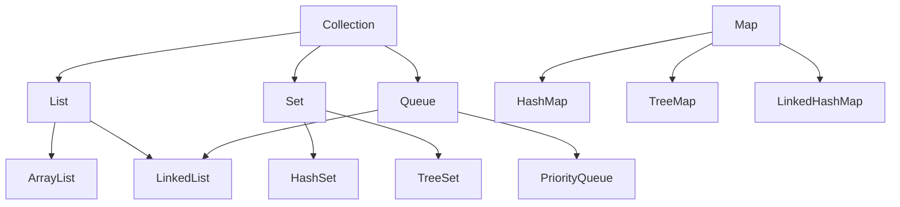

# 集合框架

> Java 集合框架提供了存储和操作一组数据的统一架构。

## 核心接口

### Collection



### List

有序、可重复的集合。

| 实现类 | 底层结构 | 特点 |
|--------|----------|------|
| ArrayList | 动态数组 | 查询快，增删慢 |
| LinkedList | 双向链表 | 增删快，查询慢 |

### Set

无序、不可重复的集合。

- **HashSet**: 基于 HashMap，无序
- **TreeSet**: 基于 TreeMap，有序
- **LinkedHashSet**: 维护插入顺序

### Map

键值对存储。

- **HashMap**: 数组+链表+红黑树
- **TreeMap**: 红黑树，key 有序
- **LinkedHashMap**: 维护插入顺序

## 常用操作示例

```java
List<String> list = new ArrayList<>();
list.add("Java");
list.add("Python");
list.forEach(System.out::println);

Map<String, Integer> map = new HashMap<>();
map.put("age", 18);
map.get("age");
```
