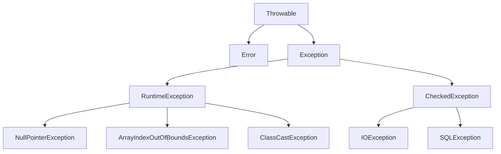

# 异常机制

> Java 异常机制是处理程序运行时错误的一种方式。

## 异常体系



## 异常分类

| 类别 | 说明 | 处理方式 |
|------|------|----------|
| **Error** | 严重错误，无法恢复 | 不处理 |
| **RuntimeException** | 运行时异常，可避免 | 可不处理 |
| **CheckedException** | 检查异常，必须处理 | try-catch 或 throws |

## 异常处理

### try-catch-finally

```java
try {
    // 可能抛出异常的代码
    int result = 10 / 0;
} catch (ArithmeticException e) {
    // 处理异常
    System.err.println("除数不能为零: " + e.getMessage());
} finally {
    // 无论是否异常都会执行
    System.out.println("资源清理");
}
```

### try-with-resources（推荐）

```java
try (BufferedReader br = new BufferedReader(new FileReader("file.txt"))) {
    System.out.println(br.readLine());
} catch (IOException e) {
    e.printStackTrace();
}
```
