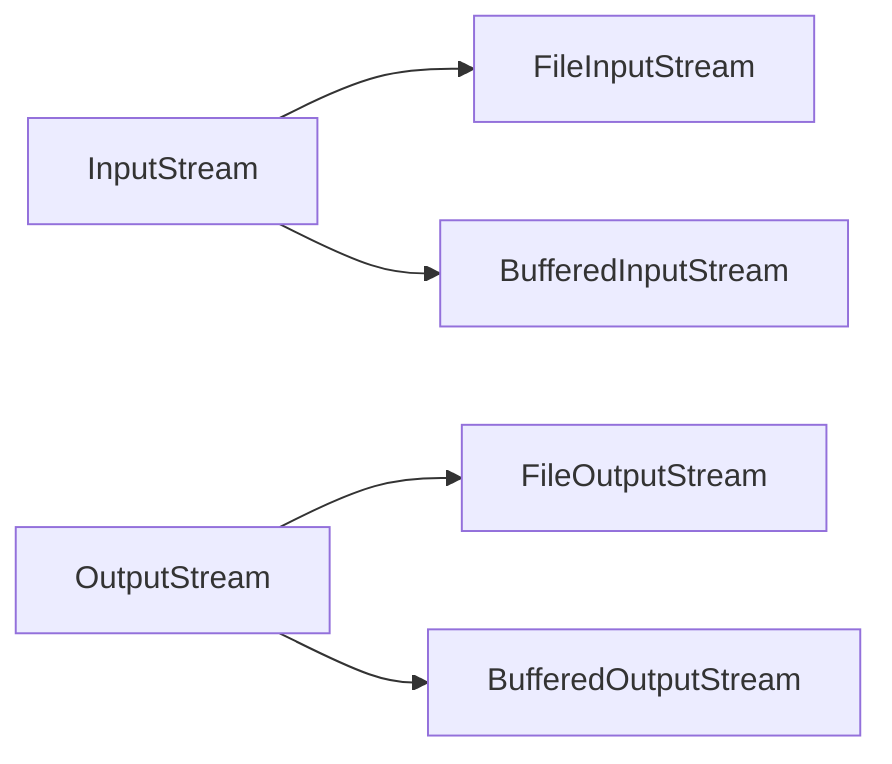
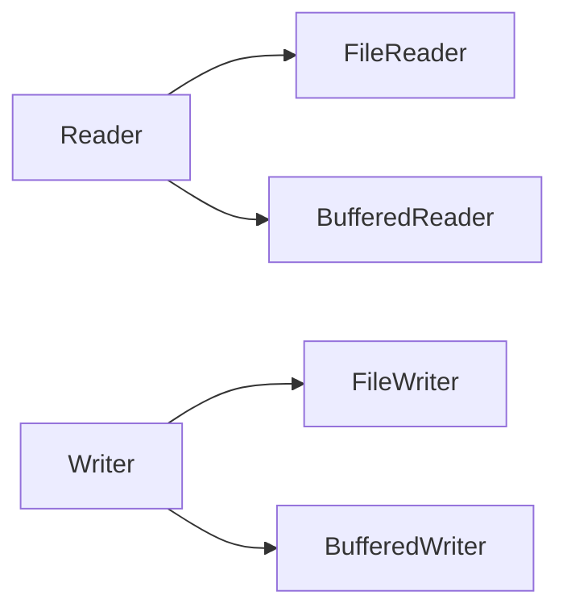

# IO 流

> Java IO 是处理输入输出的核心 API。

## 流分类

| 分类方式 | 类别 | 说明 |
|----------|------|------|
| 数据方向 | 输入流 / 输出流 | 读 / 写 |
| 数据单位 | 字节流 / 字符流 | byte / char |
| 角色 | 节点流 / 处理流 | 直接操作数据源 / 包装流 |

## 核心类

### 字节流



### 字符流



## 示例代码

### 文件复制

```java
try (FileInputStream in = new FileInputStream("source.txt");
     FileOutputStream out = new FileOutputStream("dest.txt")) {
    byte[] buffer = new byte[1024];
    int len;
    while ((len = in.read(buffer)) != -1) {
        out.write(buffer, 0, len);
    }
}
```

### 缓冲字符流

```java
try (BufferedReader br = new BufferedReader(new FileReader("file.txt"))) {
    String line;
    while ((line = br.readLine()) != null) {
        System.out.println(line);
    }
}
```
